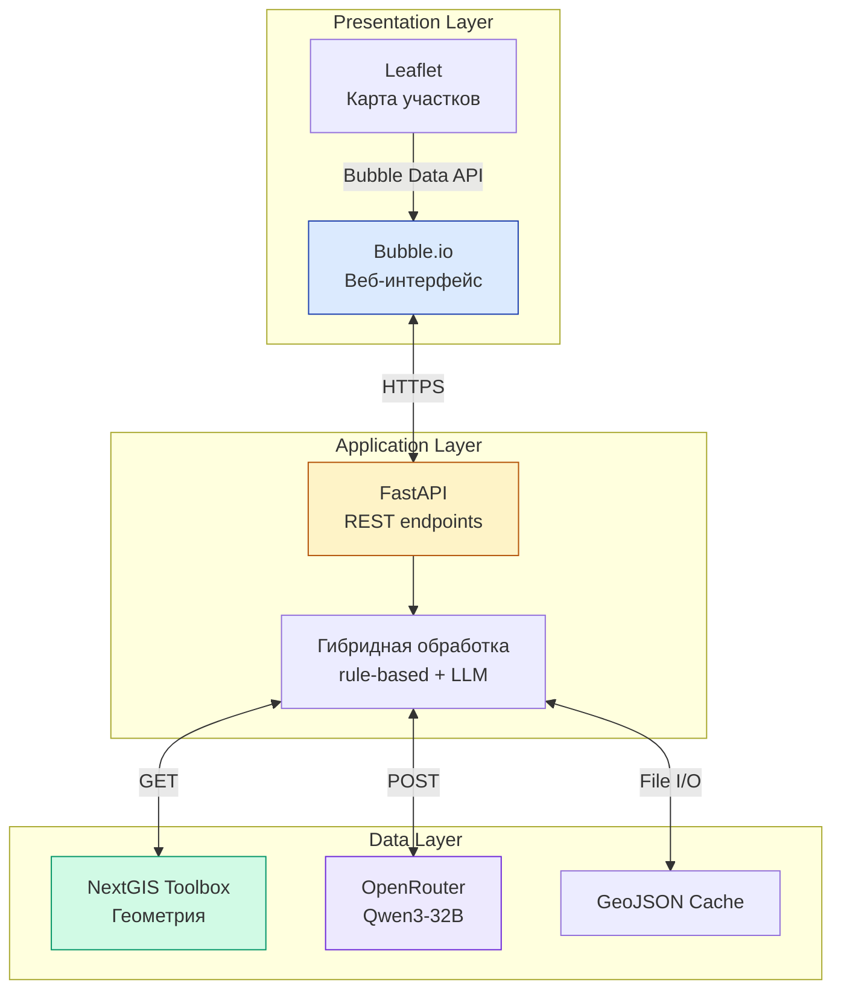

# PlotFinder

> Веб-сервис юридической проверки земельных участков с AI-анализом рисков по данным Росреестра.
> AI-powered legal due diligence service for Russian land plots.

[](LICENSE)
[](https://www.python.org/)
[](https://fastapi.tiangolo.com/)
[](https://bubble.io/)
[]()

---

## О проекте

**PlotFinder** автоматизирует юридическую проверку земельного участка через интеграцию с Росреестром (NextGIS Toolbox API), парсинг выписок ЕГРН (pdfplumber) и AI-анализ рисков большой языковой моделью Qwen3-32B (через OpenRouter).

Сервис превращает 5–14 рабочих дней ручной проверки за 15 000–30 000 ₽ в **5-минутный AI-отчёт за 490–2 990 ₽**.

### Целевая аудитория

- **Частный покупатель** — разовая проверка участка перед покупкой загородного дома
- **Риелтор / агентство** — массовый скрининг 30–500 участков в месяц
- **Инвестор / фермер** — оценка портфеля земельных активов

### Контекст разработки

Этот проект создан в рамках выпускной квалификационной работы магистратуры программы «ЛигалТех» НИУ ВШЭ (2026 год). Подробнее в разделе [Контекст ВКР](#контекст-вкр).

---

## Демо

**Live-стенд:** [http://79.143.24.76:8000/docs](http://79.143.24.76:8000/docs) (Swagger UI)

**Frontend:** [aleksandrvnikolaev-22756.bubbleapps.io](https://aleksandrvnikolaev-22756.bubbleapps.io)

**Видео-демонстрация:** *будет добавлено после записи (~3 минуты, полный цикл проверки участка)*

### Тестовые кадастры для самостоятельной проверки API

```
39:05:030615:27       — базовый тест (ИЖС, средний риск)
39:05:030616:430      — альтернативный
39:05:030615:286      — третий вариант
```

Все три участка расположены в Калининградской области.

---

## Возможности

- **Получение геометрии участка** по кадастровому номеру через NextGIS Toolbox
- **Парсинг выписок ЕГРН** в PDF без OCR (pdfplumber)
- **AI-анализ юридических рисков** через Qwen3-32B (OpenRouter) с гибридной архитектурой rule-based + LLM
- **Структурированный JSON-ответ** с уровнем риска (low/medium/high), списком рисков по категориям, рекомендациями
- **Интерактивная карта** на Leaflet 1.9.4 с инструментами рисования, маршрутизацией OSRM, расчётом площадей
- **5 механизмов отказоустойчивости** — устойчивый парсер ответа LLM, fallback-профиль, нормализация URL, обработка not_found, кэш GeoJSON

---

## Архитектура

Трёхслойная архитектура с гибридной обработкой запросов:



**Ключевая особенность:** детерминированные операции (валидация, парсинг, кэширование) выполняются на FastAPI. Интерпретация юридических рисков делегируется Qwen3-32B. Это даёт сочетание предсказуемости и гибкости.

Детально — в [`docs/architecture.md`](docs/architecture.md).

---

## Технологический стек

| Компонент | Технология | Версия |
|---|---|---|
| **Frontend** | Bubble.io (no-code) | Personal Plan |
| **Карта** | Leaflet + leaflet-draw + leaflet-routing-machine | 1.9.4 |
| **Backend** | FastAPI + Uvicorn | 0.116.1 / 0.35.0 |
| **Validation** | Pydantic v2 | 2.11.7 |
| **GIS-данные** | NextGIS Toolbox API | toolbox-sdk 0.1.0b4 |
| **LLM** | Qwen3-32B через OpenRouter | — |
| **PDF-парсинг** | pdfplumber | 0.11.9 |
| **HTTP-клиент** | requests | 2.32.5 |
| **Хостинг** | Selectel ru-2a (2 vCPU / 4 ГБ / 5 ГБ SSD) | Ubuntu 22.04 |
| **Python** | CPython | 3.10+ |

Полный список зависимостей с зафиксированными версиями — в [`backend/requirements.txt`](backend/requirements.txt).

---

## Структура репозитория

```
plotfinder/
├── README.md                       ← этот файл
├── LICENSE                         ← лицензия MIT
├── .gitignore                      ← git-игнорирование секретов и кэша
│
├── backend/                        ← серверная часть на FastAPI
│   ├── main.py                     ← основной модуль с 4 endpoints
│   ├── requirements.txt            ← Python-зависимости
│   ├── .env.example                ← шаблон переменных окружения
│   └── README.md                   ← установка и запуск backend
│
├── frontend/                       ← описание фронтенда на Bubble.io
│   ├── README.md                   ← обзор фронтенд-блока
│   ├── data-model.md               ← структура 7 Data Types
│   ├── workflows.md                ← все 41 workflow на 4 страницах
│   ├── api-connector.md            ← настройки 3 коннекторов и 7 calls
│   ├── map-element.html            ← полный HTML-код карты на Leaflet
│   └── screenshots/                ← скриншоты UI (будут добавлены)
│
├── docs/                           ← техническая и продуктовая документация
│   ├── architecture.md             ← архитектура системы с диаграммами
│   ├── api-reference.md            ← полная спецификация REST API
│   ├── deployment.md               ← развёртывание на Selectel
│   ├── financial-model.md          ← финмодель в двух сценариях A/B
│   ├── competitor-analysis.md      ← анализ 25+ конкурентов
│   ├── technical-specification.md  ← техническое задание (markdown)
│   └── technical-specification.docx ← техническое задание (Word)
│
└── thesis/                         ← дипломные материалы
    ├── README.md                   ← реквизиты ВКР и навигация
    ├── presentation.pptx           ← презентация (будет добавлено)
    └── presentation.pdf            ← презентация в PDF (будет добавлено)
```

---

## Quick Start

### Требования

- Python 3.10 или новее
- API-ключ NextGIS Toolbox (регистрация на [toolbox.nextgis.com](https://toolbox.nextgis.com/))
- API-ключ OpenRouter (регистрация на [openrouter.ai](https://openrouter.ai/))

### Установка backend локально

```bash
# Клонировать репозиторий
git clone https://github.com/AleksandrVNikolaev/plotfinder.git
cd plotfinder/backend

# Создать виртуальное окружение
python3 -m venv venv
source venv/bin/activate          # Linux/macOS
# venv\Scripts\activate.bat       # Windows

# Установить зависимости
pip install -r requirements.txt

# Настроить переменные окружения
cp .env.example .env
nano .env                          # вписать реальные ключи

# Запустить сервер
uvicorn main:app --host 0.0.0.0 --port 8000 --reload
```

Сервер будет доступен на `http://localhost:8000`. Swagger UI — на `http://localhost:8000/docs`.

Подробнее — в [`backend/README.md`](backend/README.md).

### Развёртывание на сервере

Для production-эксплуатации (systemd unit, nginx, HTTPS, мониторинг) — см. [`docs/deployment.md`](docs/deployment.md).

---

## API endpoints

Backend предоставляет 4 REST-endpoint'а:

| Метод | Endpoint | Назначение |
|---|---|---|
| `GET` | `/api/rosreestr2coord` | Геометрия участка по кадастровому номеру |
| `POST` | `/api/legal/analyze-text` | Mock-анализ по произвольному тексту |
| `POST` | `/api/legal/analyze-plot` | AI-анализ кадастра через Qwen3-32B |
| `POST` | `/api/legal/analyze-plot-with-doc` | AI-анализ кадастра + PDF выписки ЕГРН |

### Пример: получить геометрию участка

```bash
curl "http://localhost:8000/api/rosreestr2coord?cadastral=39:05:030615:27"
```

### Пример: запустить AI-анализ

```bash
curl -X POST "http://localhost:8000/api/legal/analyze-plot" \
  -H "Content-Type: application/json" \
  -d '{"cadastral": "39:05:030615:27"}'
```

Полная спецификация со всеми параметрами, схемами ответов, кодами ошибок — в [`docs/api-reference.md`](docs/api-reference.md).

---

## Документация

### Для разработчика

- [`backend/README.md`](backend/README.md) — установка backend локально
- [`docs/architecture.md`](docs/architecture.md) — архитектурные решения и диаграммы
- [`docs/api-reference.md`](docs/api-reference.md) — полная REST API спецификация
- [`docs/deployment.md`](docs/deployment.md) — развёртывание на Selectel

### Для рецензента и комиссии ВКР

- [`docs/technical-specification.md`](docs/technical-specification.md) — техническое задание (онлайн-чтение)
- [`docs/technical-specification.docx`](docs/technical-specification.docx) — техническое задание (исходный Word-документ)
- [`docs/financial-model.md`](docs/financial-model.md) — финансовая модель в двух сценариях
- [`docs/competitor-analysis.md`](docs/competitor-analysis.md) — анализ 25+ конкурентов и стратегия позиционирования
- [`thesis/README.md`](thesis/README.md) — реквизиты ВКР и структура презентации

### Для понимания фронтенда

- [`frontend/README.md`](frontend/README.md) — обзор Bubble-приложения
- [`frontend/data-model.md`](frontend/data-model.md) — структура базы данных Bubble
- [`frontend/workflows.md`](frontend/workflows.md) — описание всех workflows
- [`frontend/api-connector.md`](frontend/api-connector.md) — настройки API подключений
- [`frontend/map-element.html`](frontend/map-element.html) — HTML карты Leaflet

---

## Roadmap

### Этап 1 — Готово (май 2026)

- Поиск по кадастру и контур участка на интерактивной карте
- AI-анализ юридических рисков через Qwen3-32B
- Загрузка PDF выписки ЕГРН и парсинг через pdfplumber
- Цветной риск-профиль (зелёный / жёлтый / красный) с рекомендациями
- 5 механизмов отказоустойчивости

### Этап 2 — В работе (Q3 2026, июль–сентябрь)

- Пилот тарифов на 30–50 риелторах и 200–500 частных пользователях
- OCR для растровых PDF (pytesseract + poppler-utils)
- Сохранение истории анализов в базу
- HTTPS и собственный домен
- Индикатор прогресса AI-анализа в UI

### Этап 3 — План (Q4 2026 – 2027)

- Модуль ЗОУИТ (зоны с особыми условиями использования) через NextGIS pzz_report
- Генерация PDF-отчёта с результатами (WeasyPrint)
- API для интеграции с CRM агентств недвижимости
- Мобильное приложение iOS / Android
- Расширенный аналитический контур: RAG, векторное хранилище

Финансовые ориентиры по этапам — в [`docs/financial-model.md`](docs/financial-model.md).

---

## Контекст ВКР

Этот репозиторий — артефакт выпускной квалификационной работы.

| Параметр | Значение |
|---|---|
| **ВУЗ** | Национальный исследовательский университет «Высшая школа экономики» |
| **Программа** | Магистерская программа «ЛигалТех» |
| **Год защиты** | 2026 |
| **Студент** | Николаев Александр Владиславович, группа МЛИТЕХ 241 |
| **Научный руководитель** | Кочергин Иван Игоревич |
| **Рецензент** | Кобылкин Никита Николаевич |

### Тема работы

**На русском:**
Создание веб-сервиса размещения и поиска объявлений о купле-продаже земельных участков с интеграцией данных Росреестра и функционалом анализа юридических рисков совершения сделок.

**На английском:**
Development of a Web Service for Posting and Searching Land Sale Listings with Rosreestr Data Integration and Legal Risk Analysis Functionality.

### Декларация использования инструментов ИИ

При подготовке работы использовались: ChatGPT (OpenAI), Claude (Anthropic), Qwen3-32B (Alibaba/OpenRouter), Gamma, Gemini 2.5 Flash Image (Google), Bubble.io. Окончательные решения по содержанию работы, методологии исследования, архитектурным выборам и юридической интерпретации принимались автором лично.

---

## Лицензия

Этот проект распространяется под лицензией **MIT** — см. [LICENSE](LICENSE).

Проще говоря: можно использовать код в любых целях, включая коммерческие, при условии сохранения копирайта и текста лицензии. Никаких гарантий не предоставляется.

---

## Контакты

- **Автор:** Николаев Александр Владиславович
- **GitHub:** [@AleksandrVNikolaev](https://github.com/AleksandrVNikolaev)
- **Канал связи:** через GitHub Issues этого репозитория

Для вопросов по защите ВКР — через личный кабинет НИУ ВШЭ.

---

*Москва · 2026*
