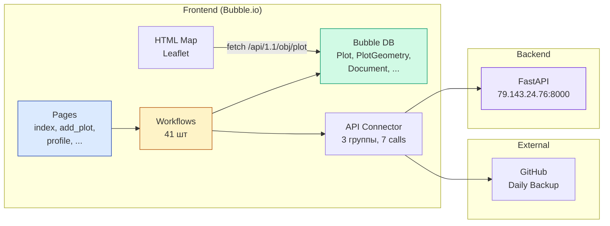

# Frontend — обзор

Фронтенд PlotFinder реализован на **no-code платформе Bubble.io**. Эта папка содержит описание структуры фронтенда, извлечённое из экспорта приложения.

> **Важно:** само приложение Bubble в виде кода не публикуется в репозитории — Bubble хранит данные в собственном проприетарном формате `.bubble`. Здесь представлены **извлечённые сведения**: структура страниц, Data Types, workflows, настройки API Connector и HTML-код карты.

---

## Где работает фронтенд

**URL приложения:** `https://aleksandrvnikolaev-22756.bubbleapps.io`

Приложение работает на инфраструктуре Bubble (USA-региона) под планом **Personal** (~2 650 ₽/мес). Доступ к редактору приложения — только у автора через аккаунт Bubble.

---

## Содержание папки

| Файл | Назначение | Размер |
|---|---|---|
| `README.md` | Этот файл — обзор frontend-блока | — |
| [`data-model.md`](data-model.md) | Структура базы данных Bubble: 7 Data Types с полями и связями | ~10 КБ |
| [`workflows.md`](workflows.md) | Все 41 workflow на 4 страницах с детальным разбором ключевых | ~12 КБ |
| [`api-connector.md`](api-connector.md) | Настройки API Connector: 3 группы, 7 calls + Recurring Event | ~10 КБ |
| [`map-element.html`](map-element.html) | Полный код HTML-элемента карты на Leaflet | ~10 КБ |
| `screenshots/` *(будет добавлено)* | Скриншоты UI продукта | — |

---

## Архитектура фронтенда

### Логическая структура

PlotFinder состоит из **7 страниц** (5 рабочих + 2 технических):

| Страница | Назначение | Доступ |
|---|---|---|
| **index** | Главная: карта + поиск + просмотр + AI-анализ | Все пользователи |
| **add_plot** | Добавление нового участка | Авторизованные |
| **profile** | Личный кабинет: список своих участков, CRUD-операции | Авторизованные |
| **reset_pw** | Сброс пароля по email | Гости |
| **404** | Страница ошибки | Все |
| **welcome_page** ×2 | Заглушки приветствия | Все |

### Стек

- **Bubble.io Personal Plan** — основная платформа
- **Bubble Auth** — встроенная авторизация (email + password)
- **Bubble Database** — 7 Data Types для хранения данных (см. [`data-model.md`](data-model.md))
- **Bubble Data API** — публичный REST endpoint к Data Types для HTML карты
- **API Connector plugin** — для вызовов backend FastAPI (см. [`api-connector.md`](api-connector.md))
- **Leaflet 1.9.4** через HTML element — основная карта (см. [`map-element.html`](map-element.html))
- **Google Maps Extended plugin** — установлен, но **не используется** (рудимент ранних экспериментов)

### Поток данных

**Ключевые наблюдения:**

1. **Карта читает данные напрямую из Bubble DB** через Data API, минуя workflows — это снижает нагрузку и упрощает архитектуру
2. **Workflows вызывают backend через API Connector** — стандартный путь Bubble для интеграций
3. **Daily backup в GitHub** работает через Recurring Event и API Connector

---

## Что в Bubble уникально для PlotFinder

В отличие от типовых Bubble-приложений, PlotFinder содержит несколько нестандартных решений:

### 1. HTML-элемент с Leaflet вместо плагина карты

Большинство Bubble-проектов используют плагины Google Maps или Leaflet. PlotFinder использует **собственный HTML-элемент** с прямой интеграцией Leaflet через CDN. Это даёт:

- Полный контроль над поведением карты (UX-защита от случайного зума по колесу мыши)
- Инструменты рисования (полигон/круг/прямоугольник) с расчётом площади
- Построение маршрутов через OSRM
- Гибкая стилизация полигонов участков (бордовый `#800020`)

См. [`map-element.html`](map-element.html) — код 250+ строк.

### 2. Гибридная связь с backend

API Connector настроен на 3 разные группы endpoint'ов:
- **Получение геометрии** (`/api/rosreestr2coord`) — простой GET
- **Юр. анализ** (`/api/legal/analyze-plot-with-doc`) — POST с долгим ответом 30–120 секунд
- **Бэкап в GitHub** (`api.github.com`) — внешний сервис

См. [`api-connector.md`](api-connector.md) — детальное описание всех 7 calls.

### 3. Custom States вместо записи AI-анализа в БД

Главный workflow «Проанализировать» сохраняет результат AI-анализа **в Custom States popup'а**, а не в Data Type LegalAnalysis. Это упрощение MVP — данные пропадают при перезагрузке страницы.

В этапе 2 дорожной карты планируется добавить запись в БД для сохранения истории анализов.

---

## Отличия от стандартного Bubble-приложения

Для рецензента, знакомого с Bubble:

| Критерий | Стандартный Bubble | PlotFinder |
|---|---|---|
| Карта | Google Maps Extended plugin | Собственный HTML на Leaflet |
| Долгие операции (LLM) | Не используются | Использует, через workflow с UX-индикатором |
| Внешний бэкенд | Через API Connector | Через API Connector + собственный FastAPI |
| История транзакций | Запись в Data Type | Custom States (упрощение MVP) |
| Privacy Rules | Настраиваются | Не настроены (этап 2) |
| Тестирование | Page Inspector + ручное | Только ручное |

---

## Что **НЕ** в этой папке (где искать)

| Что | Где |
|---|---|
| Полный исходный `.bubble` файл | НЕ публикуется (содержал секреты, очищен в локальной копии) |
| Код backend FastAPI | [`backend/`](../backend/) |
| Архитектура всей системы | [`docs/architecture.md`](../docs/architecture.md) |
| API endpoints (детально) | [`docs/api-reference.md`](../docs/api-reference.md) |
| Презентация ВКР | [`thesis/`](../thesis/) *(будет добавлено)* |

---

## Доступ к live-приложению

Для рецензента и членов комиссии возможны 3 уровня доступа к фронтенду:

### 1. Просмотр live-сайта

`https://aleksandrvnikolaev-22756.bubbleapps.io`

Доступен публично, можно зарегистрироваться и попробовать функционал.

> ⚠ **Не делитесь этой ссылкой публично** до защиты ВКР — на сервере работает реальный backend с лимитами на API-ключи.

### 2. Просмотр через Bubble Editor (read-only)

Доступ к редактору Bubble в режиме просмотра можно предоставить через Bubble:

1. Bubble Editor → Settings → Collaboration
2. **Add a collaborator** → email рецензента → роль **«Read-only»**
3. Рецензент получает приглашение и может просматривать все pages, workflows, Data Types в Bubble UI

Это позволяет увидеть **визуальное представление** всех описанных в этой папке элементов.

### 3. Документация в этом репозитории

Все технические детали и логика отражены в файлах папки `frontend/`:
- [`data-model.md`](data-model.md)
- [`workflows.md`](workflows.md)
- [`api-connector.md`](api-connector.md)
- [`map-element.html`](map-element.html)

Это самодостаточный материал для оценки технической работы без необходимости заходить в Bubble.

---

## Скриншоты UI

В папке [`screenshots/`](screenshots/) находятся снимки экрана работающего приложения. Минимальный набор:

- `01-main-page.png` — главная страница с картой
- `02-search-result.png` — результат поиска по кадастру
- `03-popup-medium-risk.png` — popup юридического анализа

Желательный расширенный набор:

- `04-popup-low-risk.png` — popup с низким риском (зелёным)
- `05-popup-high-risk.png` — popup с высоким риском (красным)
- `06-file-upload.png` — состояние загрузки PDF выписки
- `07-not-found.png` — состояние «участок не найден»
- `08-loading.png` — индикатор загрузки во время AI-анализа

> Скриншоты будут добавлены отдельно после записи демонстрационного видео.

---

## Связанные документы

- [Корневой README](../README.md) *(будет добавлено)* — общее описание проекта PlotFinder
- [`backend/README.md`](../backend/README.md) — установка и запуск серверной части
- [`docs/`](../docs/) — техническая и продуктовая документация
- [`thesis/`](../thesis/) *(будет добавлено)* — презентация и материалы ВКР
