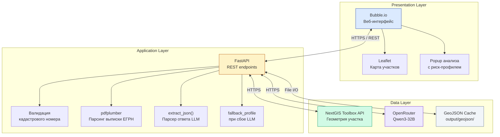
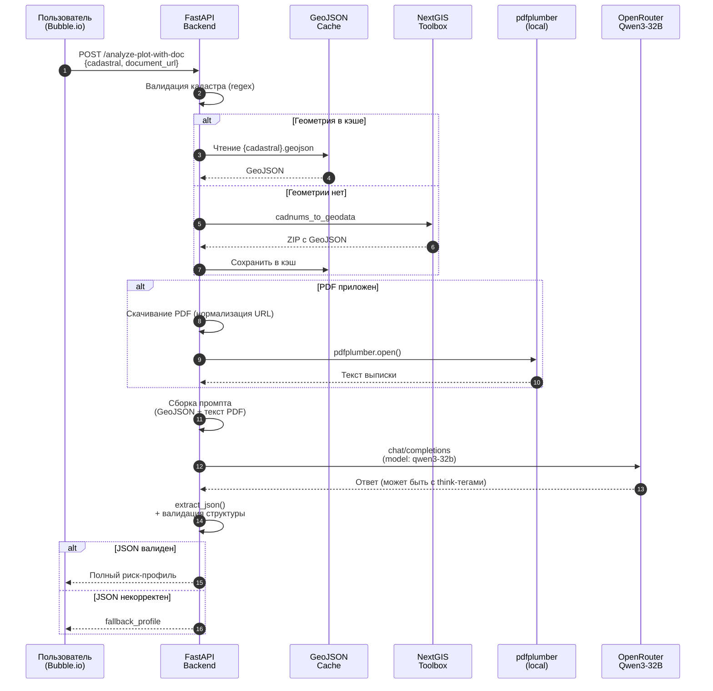
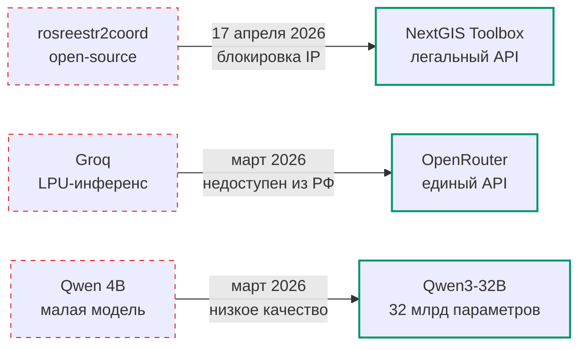

# Архитектура PlotFinder

Техническое описание архитектуры веб-сервиса юридической проверки земельных участков.

---

## Содержание

- [Обзор](#обзор)
- [Высокоуровневая диаграмма](#высокоуровневая-диаграмма)
- [Слои архитектуры](#слои-архитектуры)
  - [Presentation Layer — Bubble.io](#presentation-layer--bubbleio)
  - [Application Layer — FastAPI](#application-layer--fastapi)
  - [Data Layer — внешние API и кэш](#data-layer--внешние-api-и-кэш)
- [Поток обработки запроса](#поток-обработки-запроса)
- [Гибридная обработка: детерминированная часть и LLM](#гибридная-обработка-детерминированная-часть-и-llm)
- [Внешние интеграции](#внешние-интеграции)
- [Архитектурные решения и обоснования](#архитектурные-решения-и-обоснования)
- [Механизмы отказоустойчивости](#механизмы-отказоустойчивости)
- [Эволюция стека](#эволюция-стека)
- [Trade-offs и ограничения](#trade-offs-и-ограничения)

---

## Обзор

PlotFinder построен по классической **трёхслойной архитектуре**:

1. **Presentation Layer** — фронтенд на no-code платформе Bubble.io. Обеспечивает UI карты участков, формы ввода кадастрового номера и popup отображения юридического анализа
2. **Application Layer** — backend на FastAPI на сервере Selectel. Реализует REST API, оркестрацию запросов, парсинг PDF и взаимодействие с LLM
3. **Data Layer** — внешние API (NextGIS Toolbox, OpenRouter) и локальный кэш GeoJSON-геометрий

Ключевая архитектурная особенность — **гибридный подход к обработке**: точные детерминированные операции (валидация, парсинг, кэширование) выполняются на FastAPI, а интерпретация юридических рисков делегируется LLM Qwen3-32B через OpenRouter. Это даёт сочетание предсказуемости там, где она нужна, и гибкости там, где требуется естественный язык.

---

## Высокоуровневая диаграмма



---

## Слои архитектуры

### Presentation Layer — Bubble.io

**Назначение:** Пользовательский интерфейс веб-сервиса. Размещён как SaaS на платформе Bubble.io.

**Ответственность:**
- Отображение карты участков (Leaflet через HTML element)
- Ввод и валидация кадастрового номера на стороне UI
- Загрузка PDF-выписок ЕГРН через FileUploader
- Отображение popup'а с цветным badge риск-профиля и списком рисков/рекомендаций
- Авторизация пользователей (встроенная Bubble Auth)

**Почему Bubble.io:**
- Скорость разработки MVP — ключевой критерий для дипломной работы с ограниченным временем
- Встроенные карты Leaflet, БД, FileUploader, авторизация
- Альтернатива React + собственный сервер отвергнута из-за временных ограничений

**Ограничения:**
- Не подходит для high-load систем
- Vendor lock-in
- Стилизация ограничена возможностями Bubble Editor

В долгосрочной перспективе (Этап 3 дорожной карты) запланирован переход на собственный фронтенд React + Next.js.

---

### Application Layer — FastAPI

**Назначение:** Серверная логика. Хост: Selectel ru-2a, конфигурация 2 vCPU / 4 ГБ RAM / 5 ГБ SSD.

**Ответственность:**
- REST API для фронтенда (4 endpoint'а)
- Валидация входных данных (Pydantic-модели)
- Запросы к NextGIS Toolbox для получения геометрии
- Скачивание и парсинг PDF-выписок (pdfplumber)
- Сборка промптов для LLM с контекстом из GeoJSON и текста выписки
- Постобработка ответа LLM: извлечение JSON, валидация структуры
- Управление кэшем GeoJSON
- Обработка ошибок и нормализация ответов

**Почему FastAPI:**
- Асинхронный I/O — критично для бэкенда с медленными внешними API (LLM может отвечать 30+ секунд)
- Автогенерация OpenAPI-документации (Swagger UI на `/docs`)
- Pydantic v2 для типизированных моделей запросов/ответов
- Зрелая экосистема Python для GIS и парсинга документов

**Альтернативы:**
- **Django REST** — overkill, слишком тяжёлый для одного REST-сервиса
- **Flask** — синхронный, плохо подходит для долгих операций с LLM
- **Express.js** — потребовал бы переписывать pdfplumber и логику обработки

---

### Data Layer — внешние API и кэш

**NextGIS Toolbox API** — легальный посредник Росреестра. Предоставляет геометрию участка по кадастровому номеру.

- Тариф: ~6 000 ₽/мес за пакет запросов
- SDK: официальный `toolbox-sdk` от NextGIS
- Tool: `cadnums_to_geodata` — принимает txt с кадастрами, возвращает ZIP с GeoJSON

**OpenRouter** — единый API-шлюз к десяткам LLM-моделей.

- Модель: Qwen3-32B (Alibaba Cloud)
- Стоимость: ~0,04 ₽/запрос (на ноябрь 2026)
- Endpoint: `https://openrouter.ai/api/v1/chat/completions`

**GeoJSON Cache** — локальный кэш геометрий.

- Расположение: `./output/geojson/` (настраивается через env `GEOJSON_DIR`)
- Формат файла: `{cadastral}.geojson`, где двоеточия заменены на подчёркивания
- TTL: бессрочный (геометрия участка меняется редко, инвалидация — ручная)

---

## Поток обработки запроса

Рассмотрим самый сложный сценарий — `POST /api/legal/analyze-plot-with-doc` с приложенной PDF-выпиской:



**Время отклика:**
- Без LLM (только геометрия): ~2 секунды
- С LLM, без PDF: 30–120 секунд
- С LLM и PDF: до 2 минут

Основное время тратится на инференс Qwen3-32B на стороне OpenRouter.

---

## Гибридная обработка: детерминированная часть и LLM

Архитектурное решение, которое отличает PlotFinder от чисто-LLM решений типа RealtyCloud (rule-based) или чисто-генеративных юрботов.

```mermaid
flowchart LR
    Input[Запрос<br/>от Bubble] --> Det1[Валидация<br/>кадастра]

    subgraph Det ["Детерминированная часть"]
        direction TB
        Det1 --> Det2[Получение<br/>GeoJSON]
        Det2 --> Det3[Парсинг PDF]
        Det3 --> Det4[Сборка промпта]
    end

    Det4 --> LLM_in

    subgraph LLM ["LLM-часть"]
        direction TB
        LLM_in[Шаг 6:<br/>OpenRouter]
        LLM_in --> Categories[Анализ по категориям:<br/>ВРИ, ЗОУИТ,<br/>история прав,<br/>несоответствия]
        Categories --> JSON[Структурированный JSON]
    end

    JSON --> Det5

    subgraph Post ["Постобработка"]
        direction TB
        Det5[extract_json] --> Det6[Валидация<br/>структуры]
        Det6 --> Det7[JSON-ответ<br/>фронтенду]
    end

    style Det fill:#DBEAFE,stroke:#1E40AF
    style LLM fill:#EDE9FE,stroke:#6D28D9
    style Post fill:#D1FAE5,stroke:#059669
```



**Детерминированная часть** (шаги 1–5, 7–9): rule-based код на Python. Предсказуема, быстрая, не использует токены.

**LLM-часть** (шаг 6): передача собранного контекста в Qwen3-32B со структурированным промптом. Получение JSON-ответа со схемой:

```json
{
  "risk_score": 45,
  "summary_one_line": "Участок пригоден для ИЖС, но обнаружены признаки ограничений",
  "risks": [
    {
      "category": "ВРИ",
      "description": "Частичное попадание в охранную зону ЛЭП"
    }
  ],
  "recommendations": [
    "Запросить сведения о ЗОУИТ из ИСОГД"
  ]
}
```

**Преимущество гибрида:** LLM делает только то, что плохо формализуется — интерпретирует юридические термины и связывает их в нарратив. Всё остальное (валидация, парсинг, кэширование) делает обычный код, где предсказуемость и стоимость важнее гибкости.

---

## Внешние интеграции

### NextGIS Toolbox

| Параметр | Значение |
|---|---|
| Endpoint | через `toolbox-sdk`, скрыт в SDK |
| Используемый tool | `cadnums_to_geodata` |
| Аутентификация | API-ключ через переменную окружения `TOOLBOX_API_KEY` |
| Тариф | ~6 000 ₽/мес (включает пакет вызовов) |
| Формат входа | Текстовый файл с кадастровыми номерами (один на строку) |
| Формат выхода | ZIP-архив с GeoJSON-файлами |
| Документация | [toolbox.nextgis.com](https://toolbox.nextgis.com/) |

### OpenRouter

| Параметр | Значение |
|---|---|
| Endpoint | `https://openrouter.ai/api/v1/chat/completions` |
| Модель | `qwen/qwen3-32b` |
| Аутентификация | Bearer-токен через переменную окружения `OPENROUTER_API_KEY` |
| Стоимость | ~0,04 ₽/запрос |
| Формат запроса | OpenAI-совместимый `messages` массив |
| Формат ответа | OpenAI-совместимый `choices[0].message.content` |
| Документация | [openrouter.ai/docs](https://openrouter.ai/docs) |

### Bubble.io

| Параметр | Значение |
|---|---|
| Аутентификация | Встроенная Bubble Auth |
| FileUploader | Загрузка PDF выписок ЕГРН |
| HTML element | Leaflet карта с GeoJSON-полигоном |
| API Connector | Исходящие запросы к FastAPI |

---

## Архитектурные решения и обоснования

### Почему гибрид rule-based + LLM, а не чистый LLM

**Альтернатива:** загрузить PDF и кадастр напрямую в LLM, попросить «проанализируй».

**Проблемы такого подхода:**
1. Высокая стоимость токенов на каждый запрос (PDF-выписка занимает 5–15 страниц, это ~10К токенов только на ввод)
2. Непредсказуемость — модель может пропустить ключевые поля или галлюцинировать
3. Невозможно кэшировать данные (каждый запрос идёт в LLM заново)
4. Нет контроля над структурой ответа

**Решение PlotFinder:**
- Детерминированный код извлекает структурированные данные (площадь, ВРИ, координаты, текст PDF)
- LLM получает уже подготовленный краткий промпт с фокусом на интерпретацию
- Результат гарантированно идёт через `extract_json()` и валидацию

### Почему OpenRouter, а не прямое API Qwen или GigaChat

**OpenRouter:**
- Единый API ко всем моделям мира — можно за минуту переключиться с Qwen на Claude, GPT-4, или другую модель
- Принимает крипту — обходит санкционные ограничения для российского сервиса
- Прозрачное ценообразование

**Альтернативы и почему не они:**
- **GigaChat** — vendor lock-in на Сбер, цена 1–2 ₽/запрос против 0,04 ₽
- **YandexGPT** — закрытая экосистема, ограниченные модели
- **Прямое API Qwen** — нет официальной возможности оплаты из РФ
- **Groq** — недоступен из РФ (использовался изначально, переход в марте 2026)

### Почему Selectel, а не AWS/GCP

- **152-ФЗ:** обработка ПДн российских граждан требует хранения в РФ
- **Санкции:** AWS / GCP блокируют российские карты, есть риск потери контроля
- **Стоимость:** Selectel ru-2a ≈ 3 590 ₽/мес vs $30+ на AWS за сопоставимую конфигурацию

---

## Механизмы отказоустойчивости

В коде реализованы 5 механизмов, защищающих от типичных сбоев:

### 1. `extract_json()` — устойчивый парсер ответа LLM

Qwen3-32B иногда возвращает ответ в виде:
- `<think>...</think>` (reasoning-теги модели)
- ` ```json {...} ``` ` (markdown-фенсы)
- Прозу до и после JSON

`extract_json()` корректно обрабатывает все три случая через подсчёт балансировки скобок. Если JSON всё же некорректен — выбрасывается ValueError с диагностикой.

### 2. `fallback_profile` — дефолтный риск-профиль при сбое

Если LLM вернул невалидный JSON или сервис OpenRouter недоступен, фронтенду возвращается дефолтный профиль с пометкой что AI-анализ временно недоступен и предложением попробовать позже. Пользователь видит хоть что-то, а не пустую страницу с ошибкой 500.

### 3. Нормализация Bubble CDN URL

PDF-выписки от Bubble FileUploader приходят с URL без протокола (`//s3.amazonaws.com/...`) или относительным путём. Сервер нормализует все варианты к полным `https://...`.

### 4. `not_found` ответ — структурированный 404 с HTTP 200

При запросе несуществующего кадастра вместо HTTP 404 возвращается структурированный JSON `{not_found: true, ...}` с HTTP 200. Это упрощает обработку на стороне Bubble — фронтенд может показать сообщение «участок не найден» без сложной error-логики.

### 5. Кэш GeoJSON

Геометрии участков кэшируются локально. Повторный запрос того же кадастра не идёт в Toolbox, экономит и время (1.5 сек), и деньги (квота API). Особенно важно для разработки и демонстрации.

---

## Эволюция стека

В процессе разработки три ключевых компонента стека были заменены под давлением реальности:



Подробное описание каждого перехода — на слайде 12 презентации ВКР.

---

## Trade-offs и ограничения

### Текущие ограничения архитектуры

1. **Один инстанс FastAPI без балансировщика** — при нагрузке выше 5 000 запросов/мес потребуется горизонтальное масштабирование. Архитектура к этому готова: stateless-сервер + внешнее API + кэш на диске. Для перехода на multi-instance потребуется только Redis для разделяемого кэша.

2. **Bubble.io vendor lock-in** — фронтенд привязан к одной no-code платформе. В долгосрочной перспективе планируется свой React-фронтенд (этап 3 дорожной карты).

3. **Синхронные обращения к LLM** — пользователь ждёт ответа 30–120 секунд. Для UX лучше было бы async-pattern с polling или WebSocket, но это усложнило бы фронтенд на Bubble.

4. **Нет автотестов и CI/CD** — пока что в backlog. Для академической работы критичность невысока, но для продуктизации обязательно.

5. **Кэш без TTL** — геометрии кэшируются бессрочно. На практике это редко проблема (границы участков меняются раз в годы), но при изменении кадастра требуется ручная инвалидация кэша.

### Что архитектура обеспечивает

- ✓ Стоимость операций линейно растёт с нагрузкой (нет фиксированных «налогов»)
- ✓ Полная локализация в РФ (152-ФЗ)
- ✓ Возможность горизонтального масштабирования без переписывания кода
- ✓ Изолированность LLM-части — можно заменить Qwen3-32B на другую модель за час
- ✓ Гибрид rule-based + LLM даёт предсказуемость в критичных операциях

---

## Связанные документы

- [`backend/README.md`](../backend/README.md) — установка и запуск backend локально
- [`docs/api-reference.md`](api-reference.md) — детальная спецификация всех 4 endpoints (TBD)
- [`docs/deployment.md`](deployment.md) — инструкция по развёртыванию на Selectel (TBD)
- [Презентация ВКР](../thesis/presentation.pdf) — слайды 9, 10, 12 содержат визуализации архитектуры (TBD)
