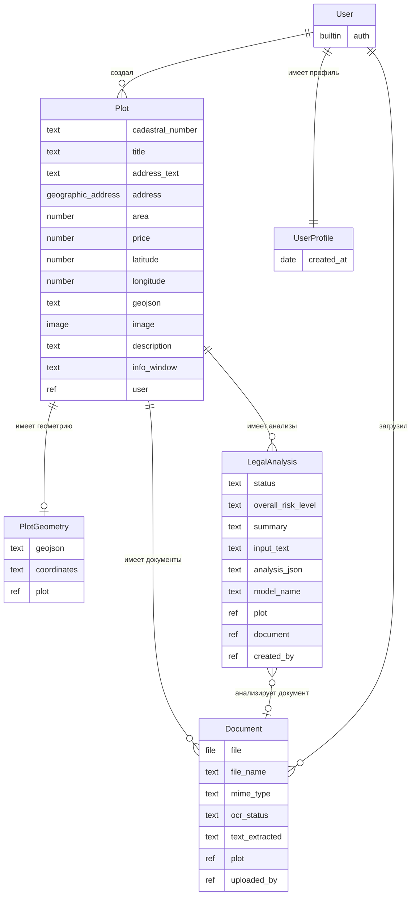
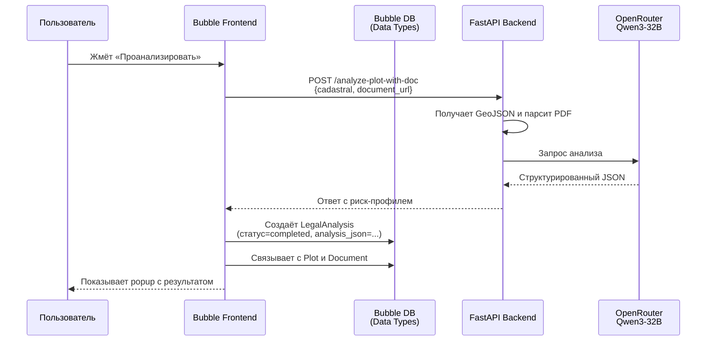

# Модель данных

Описание структуры базы данных Bubble.io для PlotFinder MVP. Документ автоматически извлечён из экспорта приложения и проверен вручную.

> Это техническая документация для разработчиков и рецензента. Описывает 7 Data Types в Bubble, их поля, связи и эволюцию модели.

---

## Содержание

- [Обзор](#обзор)
- [Диаграмма связей](#диаграмма-связей)
- [Активные Data Types](#активные-data-types)
  - [Plot](#plot--основной-тип)
  - [PlotGeometry](#plotgeometry--геометрия-участка)
  - [LegalAnalysis](#legalanalysis--результат-юр-анализа)
  - [Document](#document--прикреплённые-документы)
  - [UserProfile](#userprofile--профиль-пользователя)
  - [User](#user--встроенный-тип-bubble)
- [Устаревшие Data Types](#устаревшие-data-types)
- [Privacy и Bubble Data API](#privacy-и-bubble-data-api)
- [Связь с backend FastAPI](#связь-с-backend-fastapi)
- [Эволюция модели](#эволюция-модели)

---

## Обзор

В Bubble все данные хранятся в виде **Data Types** — это аналог таблиц в реляционной БД. Каждый Data Type содержит **поля** разных типов: text, number, date, file, image, или ссылку на другой Data Type (foreign key).

PlotFinder MVP использует **6 активных Data Types** + 1 устаревший (`plot1`):

| Тип | Назначение | Активен | Полей | Записей API |
|---|---|:---:|:---:|:---:|
| **Plot** | Земельный участок (основная сущность) | ✓ | 15 | ✓ |
| **PlotGeometry** | Геометрия участка (отдельная таблица) | ✓ | 4 | ✓ |
| **LegalAnalysis** | Результат юр. анализа от LLM | ✓ | 12 | — |
| **Document** | Прикреплённые PDF выписки ЕГРН | ✓ | 9 | — |
| **UserProfile** | Профиль пользователя (расширение User) | ✓ | 1 | ✓ |
| **User** | Встроенный тип Bubble (auth) | ✓ | 0 кастомных | ✓ |
| **Plot1** | Устаревший прототип Plot | ✗ | — | — |

«Записей API» означает что тип доступен через [Bubble Data API](https://manual.bubble.io/core-resources/api/data-api) — публично или с авторизацией.

---

## Диаграмма связей



> **Кардинальности:**
> - `||--o{` — один-ко-многим (User → много Plot)
> - `||--o|` — один-к-одному-опционально (Plot может иметь PlotGeometry)
> - `}o--o|` — много-к-одному-опционально (LegalAnalysis может ссылаться на Document)

---

## Активные Data Types

### Plot — основной тип

Земельный участок. Главная сущность модели. Содержит и метаданные участка, и геометрию (поле `geojson`), и ссылки на связанные сущности.

| Поле | Тип | Описание |
|---|---|---|
| `cadastral_number` | text | Кадастровый номер в формате `XX:XX:XXXXXXX:XX` |
| `title` | text | Заголовок участка для отображения в UI |
| `address_text` | text | Адрес как строка (для поиска и отображения) |
| `address` | geographic_address | Структурированный адрес (с координатами) |
| `area` | number | Площадь в квадратных метрах |
| `price` | number | Цена сделки (если выставлен на продажу) |
| `latitude` | number | Широта центра участка |
| `longitude` | number | Долгота центра участка |
| `geojson` | text | GeoJSON геометрии (полигон в формате JSON-строки) |
| `image` | image | Изображение участка |
| `description` | text | Описание участка |
| `info_window` | text | HTML-контент для отображения в popup карты |
| `user` | User | Создатель записи |
| `user - deleted` | UserProfile | Legacy поле (заменено на `user`) |
| `PlotGeometry - deleted` | Plot | Legacy поле (геометрия теперь в самом Plot или PlotGeometry) |

**Особенности:**

- Поле `geojson` содержит полигон в формате GeoJSON (строкой). Используется HTML-элементом карты для отрисовки контура участка через Leaflet
- Координаты центра (`latitude` + `longitude`) дублируют центроид из `geojson` — для быстрого позиционирования карты без парсинга GeoJSON
- Поле `info_window` содержит HTML с метаинформацией для popup на карте
- Тип **доступен через Bubble Data API** на `https://aleksandrvnikolaev-22756.bubbleapps.io/api/1.1/obj/plot`. Этот endpoint используется HTML-элементом карты для загрузки всех участков

---

### PlotGeometry — геометрия участка

Отдельная таблица для геометрических данных. Создана для оптимизации — чтобы не загружать тяжёлый GeoJSON каждый раз при работе со списком Plot.

| Поле | Тип | Описание |
|---|---|---|
| `geojson` | text | GeoJSON полного контура участка |
| `coordinates` | text | Координаты в текстовом виде (для backup или альтернативной отрисовки) |
| `plot` | Plot | Ссылка на связанный участок |
| `coordinates - deleted` | list of geographic_address | Legacy поле (заменено на `coordinates` text) |

**Особенности:**

- Связь 1:1 с Plot (один участок — одна геометрия)
- Дублирует поле `geojson` в Plot — это допустимо, так как Plot хранит упрощённую копию для UI, а PlotGeometry — полную для backend-операций
- Тип **доступен через Bubble Data API**

---

### LegalAnalysis — результат юр. анализа

Хранит результаты анализа участка от LLM (Qwen3-32B через OpenRouter). Каждый клик пользователя на «Проанализировать» создаёт новую запись.

| Поле | Тип | Описание |
|---|---|---|
| `status` | text | Статус анализа: `pending` / `completed` / `failed` |
| `overall_risk_level` | text | Итоговый уровень риска: `low` / `medium` / `high` / `unknown` |
| `summary` | text | Однострочное резюме (≤180 символов) |
| `input_text` | text | Промпт, отправленный в LLM (для отладки и воспроизводимости) |
| `analysis_json` | text | Полный JSON-ответ LLM (со списком рисков и рекомендаций) |
| `model_name` | text | Имя использованной LLM-модели (например, `qwen/qwen3-32b`) |
| `plot` | Plot | Анализируемый участок |
| `document` | Document | Прикреплённый PDF (если был) |
| `created_by` | User | Кто запустил анализ |
| `plot - deleted` | Plot1 | Legacy поле |
| `document - deleted` | (custom.document1) | Legacy поле |
| `created_date - deleted` | date | Legacy поле (теперь автополе Bubble) |

**Особенности:**

- `analysis_json` — это сырой ответ от backend `/api/legal/analyze-plot-with-doc`. Хранится строкой для возможности отображать историю анализов
- `model_name` — важно для академической воспроизводимости: при смене модели старые анализы остаются помеченными старым именем
- Тип **НЕ доступен через Bubble Data API** — приватная информация пользователя
- Связан и с Plot, и с Document — это позволяет хранить историю анализов одного участка с разными выписками

---

### Document — прикреплённые документы

Файлы выписок ЕГРН в PDF, загруженные пользователями для анализа.

| Поле | Тип | Описание |
|---|---|---|
| `file` | file | Сам PDF-файл (в Bubble File Storage) |
| `file_name` | text | Оригинальное имя файла |
| `mime_type` | text | MIME-тип (`application/pdf`) |
| `ocr_status` | text | Статус OCR-обработки: `not_required` / `pending` / `done` / `failed` |
| `text_extracted` | text | Извлечённый текст PDF (через pdfplumber на backend) |
| `plot` | Plot | Связанный участок |
| `uploaded_by` | User | Кто загрузил |
| `plot - deleted` | Plot1 | Legacy поле |
| `created_date - deleted` | date | Legacy поле |

**Особенности:**

- Поле `ocr_status` — задел на этап 2 дорожной карты (OCR через pytesseract для растровых PDF)
- `text_extracted` заполняется backend'ом после получения файла (через эндпоинт `/api/legal/analyze-plot-with-doc`)
- Тип **НЕ доступен через Bubble Data API** — приватные документы

---

### UserProfile — профиль пользователя

Расширение встроенного типа User дополнительными полями. Создан как заготовка под будущее расширение функциональности.

| Поле | Тип | Описание |
|---|---|---|
| `created_at` | date | Дата создания профиля |

**Особенности:**

- Сейчас содержит только одно поле — большинство данных пользователя хранятся в встроенном типе User
- Тип **доступен через Bubble Data API** — для будущих интеграций с CRM

---

### User — встроенный тип Bubble

Системный тип, предоставляемый Bubble автоматически. Содержит:

- `email` (text)
- `Authentication` (встроенный механизм Bubble Auth)
- Стандартные поля: `Created Date`, `Modified Date`, `unique id`

**Особенности:**

- Используется для авторизации (Sign Up / Log In в workflows)
- Связан с Plot (поле `user`), Document (`uploaded_by`), LegalAnalysis (`created_by`)

---

## Устаревшие Data Types

### Plot1 — устаревший прототип

Помечен флагом `deleted: true`. Был заменён на текущий `Plot` в процессе разработки.

**Причина устаревания:**
В ранних версиях MVP геометрия и метаданные участка были разделены на два типа: `Plot1` (метаданные) и отдельную таблицу геометрии. После рефакторинга решено было объединить большинство полей в `Plot` и оставить `PlotGeometry` только для оптимизации.

**Действие:** Plot1 не используется в новом коде, но удалить его из Bubble нельзя без миграции данных. В будущем — кандидат на удаление.

### Legacy-поля в активных таблицах

В активных Data Types есть поля с суффиксом ` - deleted` — это поля от ранних версий, которые помечены устаревшими, но физически не удалены (Bubble не удаляет поля автоматически, чтобы избежать потери данных).

| Тип | Legacy-поле | Заменено на |
|---|---|---|
| Plot | `user - deleted` (UserProfile) | `user` (User) |
| Plot | `PlotGeometry - deleted` (Plot1) | `geojson` или связь с PlotGeometry |
| PlotGeometry | `coordinates - deleted` (list of addresses) | `coordinates` (text) |
| Document | `plot - deleted` (Plot1) | `plot` (Plot) |
| Document | `created_date - deleted` (date) | автополе Created Date |
| LegalAnalysis | `plot - deleted` (Plot1) | `plot` (Plot) |
| LegalAnalysis | `document - deleted` | `document` (Document) |
| LegalAnalysis | `created_date - deleted` | автополе Created Date |

**Действие:** в продакшене эти поля можно безопасно игнорировать — workflows на них не ссылаются. При финализации модели после защиты — удалить через `Data → Edit data type` после миграции данных (если они есть).

---

## Privacy и Bubble Data API

### Доступ через Data API

Bubble автоматически создаёт REST-endpoint для каждого Data Type, помеченного флагом `Expose this thing via the Data API`. URL формата:

```
https://aleksandrvnikolaev-22756.bubbleapps.io/api/1.1/obj/<thing_name>
```

| Тип | Endpoint | Использование |
|---|---|---|
| Plot | `/obj/plot` | **Используется** HTML-элементом карты для загрузки участков |
| User | `/obj/user` | Встроенный, не используется явно |
| UserProfile | `/obj/userprofile` | Зарезервировано на будущее |
| PlotGeometry | `/obj/plotgeometry` | Резерв, в текущем UI не используется |
| Plot1 | (не exposed) | Устаревший |
| Document | (не exposed) | Приватные данные пользователя |
| LegalAnalysis | (не exposed) | Приватные данные пользователя |

### Privacy Rules

В текущем MVP **Privacy Rules не настроены явно** — используются дефолтные правила Bubble. Это означает:

- Любой пользователь без авторизации может читать `Plot`, `User` (только public-поля), `UserProfile`, `PlotGeometry`
- Запись/изменение/удаление требует авторизации

**Действие на этап 2:** настроить Privacy Rules:

- `Plot` → читать могут все, изменять только владелец (`This Plot's user is Current User`)
- `Document` → читать и изменять только uploader (`This Document's uploaded_by is Current User`)
- `LegalAnalysis` → аналогично, только создатель

Без этого в продакшене существует риск, что любой пользователь сможет получить чужие документы и анализы через Data API.

---

## Связь с backend FastAPI

Backend на FastAPI **не имеет своей базы данных** — он работает stateless и использует Bubble как хранилище. Архитектура взаимодействия:



Запись в Bubble DB происходит **на стороне фронтенда** в workflow «Кнопка Проанализировать нажата» — backend сам не пишет в Bubble. Это упрощает архитектуру (нет нужды передавать backend'у Bubble API-токены) и сохраняет логику данных в одном месте.

Подробнее — в [`workflows.md`](workflows.md) *(будет добавлено)*.

---

## Эволюция модели

Модель данных проходила через рефакторинги в процессе разработки. Хронология (по косвенным признакам в exported file):

### Версия 1 (примерно февраль–март 2026)

- `Plot1` (метаданные) + отдельная таблица координат
- `Document` ссылался на `Plot1`
- `LegalAnalysis` ссылался на `Plot1` и `Document`
- Координаты в `PlotGeometry` хранились как `list of geographic_address`

### Версия 2 — текущая (с апреля 2026)

- Объединение метаданных и геометрии в один `Plot`
- Создание отдельной `PlotGeometry` для оптимизации
- `Document` и `LegalAnalysis` ссылаются на `Plot` (вместо `Plot1`)
- Координаты в `PlotGeometry` хранятся как `text` (JSON-строка) — проще парсить

Решение об оптимизации связано с производительностью загрузки списка участков на главной странице — раньше Bubble подгружал тяжёлые координаты для всех участков, теперь делает это лениво.

---

## Связанные документы

- [`frontend/workflows.md`](workflows.md) *(будет добавлено)* — описание workflows, использующих эти Data Types
- [`frontend/api-connector.md`](api-connector.md) *(будет добавлено)* — как backend FastAPI связан с этой моделью
- [`docs/architecture.md`](../docs/architecture.md) — общая архитектура системы
- [`docs/api-reference.md`](../docs/api-reference.md) — REST API backend, который заполняет эти таблицы
