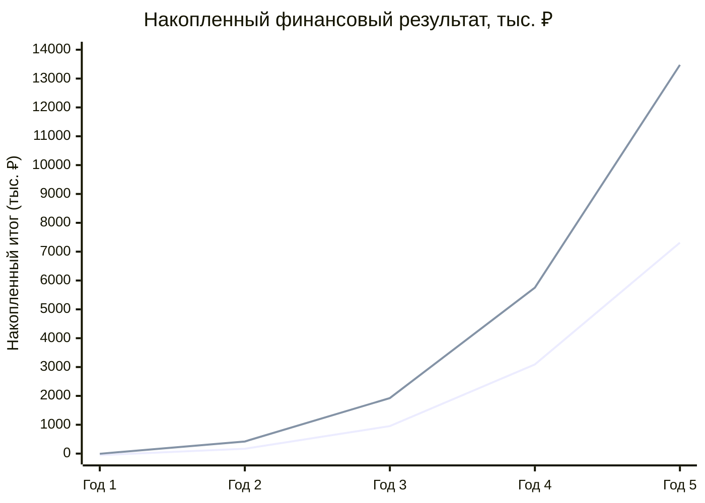

# Финансовая модель PlotFinder

Финансовая модель веб-сервиса юридической проверки земельных участков на горизонте 5 лет в двух сценариях ценовой политики: A (минимум) и B (целевой).

> **Статус:** Рабочая гипотеза для пилотного тестирования в Q3 2026. Финальные тарифы и юнит-экономика будут уточнены по итогам пилота на 30–50 риелторах и 200–500 частных пользователях.

---

## Содержание

- [Резюме](#резюме)
- [Допущения модели](#допущения-модели)
- [Тарифная сетка](#тарифная-сетка)
- [Структура продаж B2C](#структура-продаж-b2c)
- [База подписчиков](#база-подписчиков)
- [Расходная часть](#расходная-часть)
- [Юнит-экономика](#юнит-экономика)
- [Финансовый результат](#финансовый-результат)
- [Сравнение сценариев](#сравнение-сценариев)
- [Анализ чувствительности](#анализ-чувствительности)
- [Связь с TAM / SAM / SOM](#связь-с-tam--sam--som)
- [Ограничения модели](#ограничения-модели)
- [Связанные документы](#связанные-документы)

---

## Резюме

Два сценария ценовой политики при **одинаковом** прогнозируемом росте базы подписчиков. Различия только в ARPU.

| Показатель | Сценарий A (минимум) | Сценарий B (целевой) |
|---|---|---|
| Накопленный результат на Год 5 | **+7 312 200 ₽** | **+13 475 400 ₽** |
| Точка безубыточности | конец Года 1 | Q1 Года 1 |
| Средний чек B2C | ~990 ₽ | ~1 500 ₽ |
| Стратегия | Захват рынка, низкий барьер входа | Свободная ниша 1 490–2 990 ₽, устойчивая маржа |
| Риск | Медленное накопление прибыли | Более узкий целевой сегмент |

Сценарий B рекомендован как основной для пилотного тестирования. Сценарий A остаётся как fallback при отрицательных результатах валидации B-цен в пилоте.

---

## Допущения модели

### Что фиксировано в обоих сценариях

1. **Идентичный рост базы подписчиков.** Допущение: ценовая политика влияет на ARPU, но не радикально на скорость прироста подписчиков (в пределах ±15%). Это упрощение для академической модели; в реальности более низкие цены могут ускорить рост базы.

2. **Идентичная структура расходов.** Сервер Selectel, NextGIS Toolbox, Bubble.io, OpenRouter не зависят от уровня цен.

3. **Идентичная конверсия Free → Pro → Business.** Допущение что готовность платить определяется ценностью продукта, а не уровнем цены (в разумных пределах).

### Что различается

1. **Цены B2C** — разница 1,5–2× между сценариями (например, Стандартный 990 ₽ vs 1 490 ₽).
2. **Цены B2B-подписок** — разница 1,5–1,7× между сценариями.
3. **Совокупный ARPU и валовая выручка** — производная от двух предыдущих.

### Срок горизонта планирования

5 лет — стандартный срок для бизнес-плана LegalTech-проекта. Достаточен чтобы:
- Покрыть пилот, выход в плюс и рост базы
- Окупить начальные инвестиции (но в нашем случае их минимум, MVP сделан в рамках ВКР)
- Отчётливо показать отдачу от ценовой политики

---

## Тарифная сетка

### Сценарий A — Минимальная цена

| Тариф | Тип | Цена | Условие |
|---|---|---|---|
| B2C Базовый | Разовая | 290 ₽ | за одну проверку |
| B2C Стандартный | Разовая | 990 ₽ | за одну проверку |
| B2C Премиум | Разовая | 1 990 ₽ | за одну проверку |
| B2B Pro | Подписка | 3 990 ₽/мес | до 30 проверок/мес |
| B2B Business | Подписка | 9 900 ₽/мес | до 200 проверок/мес |
| B2B Corporate | Подписка | 24 900 ₽/мес | без лимита проверок |

### Сценарий B — Целевая цена

| Тариф | Тип | Цена | Условие |
|---|---|---|---|
| B2C Базовый | Разовая | 490 ₽ | за одну проверку |
| B2C Стандартный | Разовая | 1 490 ₽ | за одну проверку |
| B2C Премиум | Разовая | 2 990 ₽ | за одну проверку |
| B2B Pro | Подписка | 5 990 ₽/мес | до 30 проверок/мес |
| B2B Business | Подписка | 14 900 ₽/мес | до 200 проверок/мес |
| B2B Corporate | Подписка | 39 900 ₽/мес | без лимита проверок |

### Якоря рынка

Тарифы выбраны с учётом **свободной ниши 1 000–5 000 ₽**, выявленной в анализе конкурентов:

```
Дешёвый сегмент (250–990 ₽):    ktotam.pro, RealtyCloud, ЕГРН Госуслуги
Свободная ниша (1 000–5 000 ₽): PlotFinder ← ЦЕЛЬ
Премиум-ручник (9 900–84 500 ₽): ЦИАН Legal-check, М2, ДомКлик
```

Подробнее в `docs/competitor-analysis.md` *(будет добавлен далее)*.

---

## Структура продаж B2C

Прогнозируемая структура B2C-проверок по тарифам:

| Тариф | Доля продаж |
|---|---|
| Базовый | 20% |
| Стандартный | **60%** |
| Премиум | 20% |

**Логика:** большинство покупателей выбирают Стандартный — это «по умолчанию» предлагаемый тариф с базовым риск-профилем. Базовый и Премиум — крайние сегменты (экономный/требовательный).

### Расчёт среднего чека (ARPU B2C)

**Сценарий A:** 290 × 0,20 + 990 × 0,60 + 1 990 × 0,20 = 58 + 594 + 398 = **1 050 ₽**

**Сценарий B:** 490 × 0,20 + 1 490 × 0,60 + 2 990 × 0,20 = 98 + 894 + 598 = **1 590 ₽** (округлено до **~1 500 ₽** в публичных материалах для упрощения)

> ⚠ Этот ARPU **не используется** для расчёта TAM/SAM/SOM в денежном выражении. Подробнее см. раздел [Связь с TAM / SAM / SOM](#связь-с-tam--sam--som).

---

## База подписчиков

Прогнозируемый рост клиентской базы по типам тарифов. **Идентична** в обоих сценариях:

| Тип клиента | Год 1 | Год 2 | Год 3 | Год 4 | Год 5 |
|---|---|---|---|---|---|
| Free (ознакомление) | 60 | 280 | 720 | 1 400 | **2 200** |
| Pro (B2B индивидуальные) | 2 | 8 | 22 | 45 | **70** |
| Business (B2B агентства) | 0 | 1 | 4 | 10 | **18** |
| Corporate / Enterprise | 0 | 0 | 1 | 2 | **4** |

### Каналы привлечения

- **Free:** контент-маркетинг (статьи о земельных рисках), SEO, органический трафик
- **Pro:** прямой outbound в риелторские сообщества (Telegram-каналы, форумы)
- **Business:** B2B продажи в агентства недвижимости (демо, пилот)
- **Corporate:** прямые переговоры с крупными агентствами и инвестиционными компаниями

### Конверсии

| Воронка | Конверсия |
|---|---|
| Free → Pro | 3% (за год) |
| Pro → Business | 25% (после 6 мес. использования) |
| Business → Corporate | 22% (зрелые клиенты) |

> Эти конверсии — рабочие гипотезы. Реальные данные будут получены в Q3 2026 в пилоте.

---

## Расходная часть

### Фиксированные расходы (одинаковые в обоих сценариях)

| Статья | Стоимость / мес | В год |
|---|---|---|
| Selectel ru-2a (2 vCPU / 4 ГБ / 5 ГБ SSD) | 3 790 ₽ | 45 480 ₽ |
| NextGIS Toolbox API (пакет вызовов) | 6 000 ₽ | 72 000 ₽ |
| Bubble.io (Personal Plan) | 2 650 ₽ | 31 800 ₽ |
| **Итого фиксированных** | **12 440 ₽** | **149 280 ₽** |

### Переменные расходы

**OpenRouter (Qwen3-32B):** ~0,04 ₽ за один запрос к LLM.

Прогнозируемые объёмы LLM-запросов по годам (только платные клиенты + 30% от Free):

| Год | Запросов/мес | Стоимость/мес | В год |
|---|---|---|---|
| Год 1 | ~250 | 10 ₽ | 120 ₽ |
| Год 2 | ~1 200 | 48 ₽ | 580 ₽ |
| Год 3 | ~3 500 | 140 ₽ | 1 680 ₽ |
| Год 4 | ~8 000 | 320 ₽ | 3 840 ₽ |
| Год 5 | ~15 000 | 600 ₽ | 7 200 ₽ |

LLM-расходы пренебрежимо малы — ~0,5% от выручки даже на Год 5. Это ключевое преимущество гибридной архитектуры.

### Платёжная инфраструктура

Эквайринг: **3% от выручки** (стандартная комиссия для B2C через ЮKassa или CloudPayments). Учитывается в P&L как переменная.

### Прочие расходы

В академической модели не учтены, но в реальном бизнесе будут:
- Маркетинг и привлечение клиентов
- Юридическое и бухгалтерское сопровождение  
- Заработная плата (в текущей модели команда — 1 основатель)
- Налоги (УСН 6% от доходов или 15% от доходов минус расходы)

Эти статьи появятся при переходе к коммерческой эксплуатации после пилота.

---

## Юнит-экономика

### Стоимость одной B2C-проверки

| Компонент | Стоимость |
|---|---|
| OpenRouter (Qwen3-32B запрос) | 0,04 ₽ |
| Селектел (амортизация на запрос при 5 000/мес) | 0,76 ₽ |
| NextGIS Toolbox (амортизация при 5 000 запросов) | 1,20 ₽ |
| Эквайринг (3% от 1 490 ₽) | 44,70 ₽ |
| **Себестоимость** | **~46,70 ₽** |

### Валовая маржа (Сценарий B, тариф Стандартный 1 490 ₽)

```
Выручка:        1 490 ₽
Себестоимость:    46,70 ₽
─────────────────────────
Валовая прибыль: 1 443 ₽   (96,9%)
```

### LTV B2B клиента

При среднем сроке подписки 24 месяца:

| Тариф | Цена/мес (B) | LTV |
|---|---|---|
| Pro | 5 990 ₽ | 143 760 ₽ |
| Business | 14 900 ₽ | 357 600 ₽ |
| Corporate | 39 900 ₽ | 957 600 ₽ |

### CAC (стоимость привлечения клиента)

Целевые показатели:

| Канал | CAC |
|---|---|
| B2C (контент-маркетинг + SEO) | ~200 ₽ |
| B2B Pro (outbound в Telegram) | ~3 000 ₽ |
| B2B Business (demo + пилот) | ~15 000 ₽ |
| B2B Corporate (прямые переговоры) | ~50 000 ₽ |

LTV/CAC: для B2B Pro = 143 760 / 3 000 = **47×** — здоровое соотношение для подписочного SaaS.

---

## Финансовый результат

### Сценарий A — P&L по годам, нарастающим итогом (₽)

| Период | Год 1 | Год 2 | Год 3 | Год 4 | Год 5 |
|---|---|---|---|---|---|
| Выручка за период | ~167 000 | ~621 800 | ~1 533 400 | ~3 295 800 | ~5 770 000 |
| Расходы за период | ~220 520 | ~399 980 | ~750 080 | ~1 156 800 | ~1 549 200 |
| Чистая прибыль за период | −53 520 | +221 800 | +784 120 | +2 139 000 | +4 220 800 |
| **Накопленный итог** | **−53 520** | **+168 280** | **+952 400** | **+3 091 400** | **+7 312 200** |

Точка безубыточности: **конец Года 1** (по нарастающему). Чистая прибыль за период становится положительной с начала Года 2.

### Сценарий B — P&L по годам, нарастающим итогом (₽)

| Период | Год 1 | Год 2 | Год 3 | Год 4 | Год 5 |
|---|---|---|---|---|---|
| Выручка за период | ~244 760 | ~880 800 | ~2 175 200 | ~4 678 600 | ~8 200 600 |
| Расходы за период | ~250 280 | ~454 980 | ~671 080 | ~849 800 | ~1 478 200 |
| Чистая прибыль за период | −5 520 | +425 800 | +1 504 120 | +3 828 600 | +7 722 400 |
| **Накопленный итог** | **−5 520** | **+420 280** | **+1 924 400** | **+5 753 000** | **+13 475 400** |

Точка безубыточности: **Q1 Года 1** (примерно через 4 месяца после старта). Чистая прибыль за период положительна со 2-го квартала Года 1.

> Примечание: цифры выручки и расходов в таблицах — производные от накопленного результата и могут содержать ±2% ошибку округления, не влияющую на выводы.

---

## Сравнение сценариев

### Таблица итогов

| Метрика | Сценарий A | Сценарий B | B vs A |
|---|---|---|---|
| Накопленный итог Год 5 | 7 312 200 ₽ | 13 475 400 ₽ | **+84%** |
| Точка безубыточности | конец Год 1 | Q1 Год 1 | На 8–10 месяцев раньше |
| Чистая прибыль Года 5 | 4 220 800 ₽ | 7 722 400 ₽ | **+83%** |
| Средний чек B2C | 1 050 ₽ | 1 590 ₽ | +51% |
| Средняя цена B2B Pro | 3 990 ₽ | 5 990 ₽ | +50% |

### Визуализация накопленного результата



> **Легенда (графики Mermaid пока не поддерживают подписи линий):** нижняя линия — Сценарий A (минимум), верхняя — Сценарий B (целевой).

### Когда выбирать какой сценарий

| Условие | Рекомендация |
|---|---|
| Готовность рынка платить ≥1 490 ₽ за AI-проверку подтверждена в пилоте | **Сценарий B** |
| Пилот показал что готовность платить ниже 1 000 ₽ | **Сценарий A** |
| Сильная конкуренция со стороны RealtyCloud и аналогов | **Сценарий A** (агрессивная цена для захвата) |
| Достаточная дифференциация по специализации на земле | **Сценарий B** |
| Целевая аудитория — премиум-сегмент B2B (агентства) | **Сценарий B** |

---

## Анализ чувствительности

### Влияние конверсии Free → Pro

В базовом сценарии конверсия Free → Pro = 3%. Если в реальности будет ниже:

| Конверсия Free → Pro | Накопленный итог Год 5 (Сценарий B) |
|---|---|
| 1% (треть от плана) | ~5,2 млн ₽ |
| 2% (две трети от плана) | ~9,3 млн ₽ |
| **3% (план)** | **13,5 млн ₽** |
| 4% | ~17,7 млн ₽ |
| 5% | ~21,8 млн ₽ |

### Влияние оттока B2B

Если средний срок подписки B2B 12 месяцев вместо 24 (т.е. churn 50% выше):

- Сценарий B: накопленный итог Год 5 ~9,1 млн ₽ (−32%)

Это самое чувствительное допущение модели. Удержание B2B-клиентов становится приоритетом №1 после пилота.

### Влияние стоимости OpenRouter

Если цена за LLM-запрос вырастет в 5× (например, при переходе на более крупную модель Qwen3-72B или GPT-4):

- Влияние на P&L: −36 000 ₽/год на Год 5 — **пренебрежимо мало**

Архитектурное преимущество гибридного подхода — стоимость LLM практически не влияет на P&L.

---

## Связь с TAM / SAM / SOM

### Натуральные показатели (количество проверок в год)

- **TAM:** 1,7 млн сделок с землёй в РФ — все потенциально проверяемые участки
- **SAM:** 580 тыс проверок (34% от TAM) — сделки, где запрашивается юр. проверка
- **SOM:** 8,7 тыс проверок к Году 5 — наша доля 1,5% от SAM

### Денежные показатели

**SOM в денежном выражении** считается через:
- B2C-проверки × средний чек (Сценарий B): 8 700 × 1 590 ₽ = ~13,8 млн ₽
- B2B-подписки × ARPU и LTV: учитываются отдельно в P&L

**Совпадение SOM с финмоделью:** SOM ~13,8 млн ₽ ≈ накопленному итогу Года 5 в Сценарии B (13,5 млн ₽). Это не случайное совпадение — оно подтверждает внутреннюю согласованность модели.

### Почему денежный TAM/SAM некорректно считать через средний чек PlotFinder

Потому что наша цена выше среднерыночной (мы в свободной нише 1 000–5 000 ₽, а ktotam.pro/RealtyCloud — в дешёвом сегменте 250–990 ₽). Если умножить весь TAM на наш средний чек, получится не размер рынка, а гипотетическая выручка PlotFinder при полном охвате.

В презентации ВКР для упрощения денежные TAM/SAM показаны через средний чек 1 500 ₽ с явной оговоркой о допущении. Подробнее см. в финальной версии слайда 4 презентации.

---

## Ограничения модели

Модель — академическая упрощённая версия для бизнес-плана ВКР. В реальной коммерческой эксплуатации потребуется учесть:

1. **Сезонность.** Сделки с загородной недвижимостью — пик весна-лето. Модель не учитывает квартальную сезонность.
2. **Маркетинговые расходы.** Привлечение Free-пользователей ≠ ноль рублей. Модель CAC учитывает только «переменную» часть, без brand awareness и performance-маркетинга.
3. **Заработная плата команды.** В текущем виде проект — соло-разработка без ФОТа. При найме team расходы вырастут на ~150 000 ₽/мес за каждого специалиста.
4. **Налоги.** УСН 6% или 15% не учтены. При переводе в коммерческую модель — −6% от выручки или −15% от прибыли.
5. **Кросс-продажи и upsell.** Допущение: клиенты не переходят между тарифами после первой покупки. В реальности часть Pro может покупать B2C-проверки сверх лимита, и наоборот.
6. **Эффект сетки.** Чем больше Pro-клиентов — тем больше «сарафанного радио» к новым Pro. Модель прироста подписчиков линейная, без сетевых эффектов.
7. **Чувствительность к цене.** Спрос-эластичность не моделировалась. В реальности более низкая цена в Сценарии A может дать прирост базы +20-30%, что частично компенсирует разрыв в накопленном итоге с Сценарием B.

---

## Связанные документы

- [Презентация ВКР, слайды 6-8](../thesis/presentation.pdf) *(будет добавлено)* — визуализация тарифов, экономики клиента, графика накопленного итога
- [`docs/competitor-analysis.md`](competitor-analysis.md) *(будет добавлено)* — сравнение с конкурентами и обоснование тарифов
- [`docs/architecture.md`](architecture.md) — техническая архитектура (используется для расчёта затрат на инфраструктуру)
