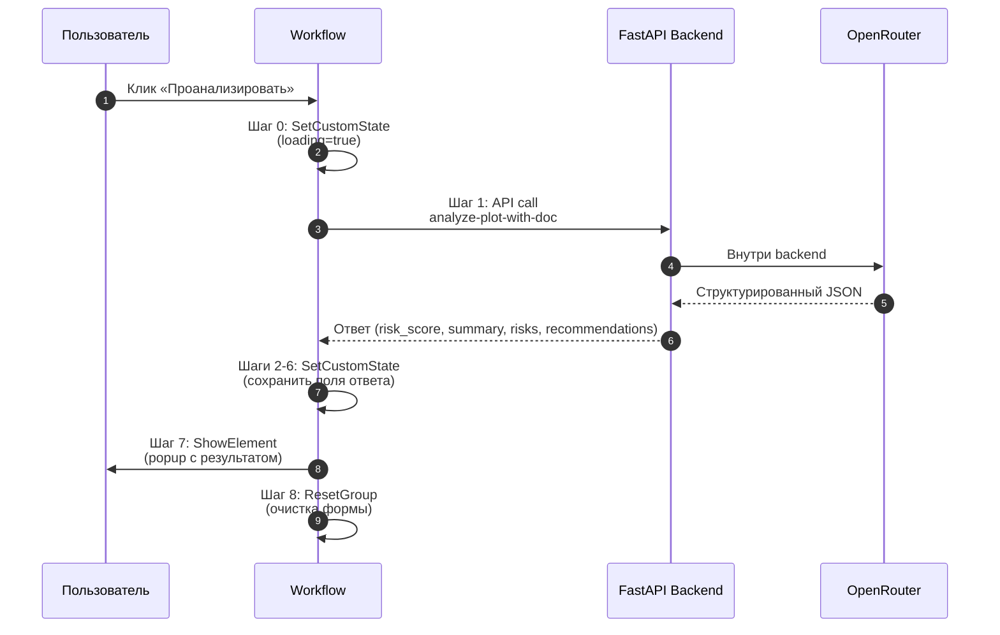

# Workflows — рабочие процессы фронтенда

Описание всех workflows (рабочих процессов) фронтенда PlotFinder в Bubble.io. Особое внимание уделено двум ключевым процессам — «Проанализировать» и «Добавить участок», которые делают реальную работу с backend и базой данных.

> Workflow в Bubble — это последовательность шагов, выполняемая в ответ на событие (клик кнопки, загрузка страницы, изменение значения). Аналог event handler'ов в обычной разработке.

---

## Содержание

- [Обзор](#обзор)
- [Сводка по всем страницам](#сводка-по-всем-страницам)
- [Главный workflow: «Кнопка Проанализировать нажата»](#главный-workflow-кнопка-проанализировать-нажата)
- [Второй ключевой workflow: «Добавить участок»](#второй-ключевой-workflow-добавить-участок)
- [Workflows на странице index](#workflows-на-странице-index)
- [Workflows на странице add_plot](#workflows-на-странице-add_plot)
- [Workflows на странице profile](#workflows-на-странице-profile)
- [Workflow на странице reset_pw](#workflow-на-странице-reset_pw)
- [Архитектурные паттерны](#архитектурные-паттерны)
- [Связанные документы](#связанные-документы)

---

## Обзор

В Bubble фронтенд состоит из **страниц** (pages), на каждой из которых могут быть настроены **workflows** — реакции на события. Возможные триггеры:

- **ButtonClicked** — клик по кнопке (самый частый)
- **PageLoaded** — загрузка страницы
- **InputChanged** — изменение значения в input/dropdown
- **CustomEvent** — вызывается из другого workflow программно
- **RecurringEvent** — выполняется по расписанию (например, daily backup)

Каждый workflow — это **последовательность шагов** (actions), которые выполняются по очереди. Шаги могут включать API-вызовы, операции с БД, изменение состояния UI, переходы между страницами.

В PlotFinder MVP настроен **41 workflow на 4 страницах**.

---

## Сводка по всем страницам

| Страница | Назначение | Workflows | Ключевые workflows |
|---|---|:---:|---|
| **index** | Главная с картой и поиском | 15 | «Проанализировать», «Поиск» |
| **add_plot** | Добавление участка | 9 | «Добавить участок» (с API-вызовами Rosreestr) |
| **profile** | Личный кабинет | 16 | «Редактировать участок», «Удалить», «Сохранить изменения» |
| **reset_pw** | Сброс пароля | 1 | ResetPassword + ChangePage |
| **404, welcome_page** | Технические | 0 | — |

---

## Главный workflow: «Кнопка Проанализировать нажата»

Это **сердце фронтенда** — workflow который запускает AI-анализ юридических рисков и показывает результат пользователю. Расположен на странице `index`.

### Триггер

**Событие:** `ButtonClicked` — клик по кнопке «Проанализировать» в popup со сведениями об участке.

### Последовательность шагов

### Детальное описание шагов

| Шаг | Action | Назначение |
|:---:|---|---|
| 0 | **SetCustomState** | Установка состояния загрузки (`loading_state` = `true`) для отображения спиннера |
| 1 | **API Call** `apiconnector2-bTHlJ.bTHlX` | Вызов `Legal Analyze Plot With Doc` (POST `/api/legal/analyze-plot-with-doc`) с параметрами `cadastral` и `document_url` |
| 2 | **SetCustomState** | Сохранение поля `risk_score` из ответа в Custom State popup'а |
| 3 | **SetCustomState** | Сохранение `summary_one_line` |
| 4 | **SetCustomState** | Сохранение списка `risks` |
| 5 | **SetCustomState** | Сохранение списка `recommendations` |
| 6 | **SetCustomState** | Сохранение `analyzed_with_document` (флаг наличия PDF) |
| 7 | **ShowElement** | Показ popup'а «AI Анализ участка» с заполненными полями |
| 8 | **ResetGroup** | Сброс формы загрузки PDF (FileUploader) для следующего использования |

### Использование Custom States

В Bubble **Custom States** — это аналог local state в React. Они привязаны к элементу UI (в данном случае к popup'у `Popup AI Анализ участка`) и используются для временного хранения данных в памяти страницы без записи в БД.

В этом workflow используется 5 Custom States:

| State | Тип | Источник |
|---|---|---|
| `risk_score` | text | Field из ответа API call (шаг 1) |
| `summary_one_line` | text | Field из ответа |
| `risks` | list of texts (или JSON) | Field из ответа |
| `recommendations` | list of texts | Field из ответа |
| `analyzed_with_document` | yes/no | Field из ответа |

После заполнения Custom States содержимое popup'а отрисовывается через **Dynamic data** — каждый Text element в popup'е читает соответствующее поле State.

### Связь с backend

Шаг 1 вызывает endpoint `/api/legal/analyze-plot-with-doc`, который описан в [`docs/api-reference.md`](../docs/api-reference.md#post-apilegalanalyze-plot-with-doc).

**Время отклика:** 30–120 секунд при анализе только по кадастру, до 2 минут с PDF. Custom State `loading_state` обеспечивает UX в течение этого времени.

### Что НЕ делает этот workflow

Заметная архитектурная особенность — workflow **не пишет результат анализа в Bubble DB**. Все данные хранятся только в Custom States и пропадают при перезагрузке страницы.

Это упрощение MVP. Для этапа 2 дорожной карты запланировано:

- Добавить в конце шаг **CreateThing** для записи в Data Type `LegalAnalysis` (см. [`data-model.md`](data-model.md#legalanalysis--результат-юр-анализа))
- Связать новую запись с Plot и Document
- Это даст историю анализов в личном кабинете пользователя

---

## Второй ключевой workflow: «Добавить участок»

Этот workflow на странице `add_plot` создаёт новую запись Plot, обращаясь к backend для получения геометрии. Используется владельцами участков для добавления своих лотов на карту.

### Триггер

**Событие:** `ButtonClicked` — клик по кнопке «Добавить участок» в форме на странице `add_plot`.

### Последовательность шагов

| Шаг | Action | Назначение |
|:---:|---|---|
| 0 | **AlertShowMessage** | Показ алерта «Загрузка данных участка…» (UX) |
| 1 | **API Call** `apiconnector2-bTHHR.bTHJH` | Rosreestr2coord Action (text) — получение GeoJSON как text |
| 2 | **API Call** `apiconnector2-bTHHR.bTHHW` | Rosreestr2coord Action (структурированный) — получение полей участка |
| 3 | **NewThing** | Создание новой записи Plot (с метаданными из шага 2) |
| 4 | **NewThing** | Создание связанной записи PlotGeometry (с GeoJSON из шага 1) |
| 5 | **ChangeThing** | Связывание Plot ↔ PlotGeometry (заполнение поля `plot` в PlotGeometry) |
| 6 | **ChangeThing** | Дополнительное поле в Plot (например, `user = Current User`) |

### Архитектурное замечание

Использование **двух API-вызовов** к одному backend endpoint'у с разной обработкой (text vs JSON) — следствие того, что Bubble одинаково плохо работает с текстом GeoJSON и со структурированными полями одновременно. Решение — два отдельных вызова:

- **Action (text)** — отдаёт GeoJSON как сырую строку для записи в `PlotGeometry.geojson`
- **Action (структурированный)** — отдаёт распарсенные поля (площадь, адрес, категория) для записи в Plot

В будущем можно объединить через один вызов и парсинг на стороне Bubble, но пока работает текущая схема.

### Что важно для рецензии

Этот workflow демонстрирует:

1. **Прозрачное разделение ответственности** — backend отдаёт сырые данные, фронтенд решает как их сохранить
2. **Два связанных Data Types** (Plot + PlotGeometry) — нормализация данных
3. **Транзакционность через ChangeThing** — связи устанавливаются после создания записей

---

## Workflows на странице index

15 workflows на главной странице. Группируются по 4 категориям.

### Авторизация (8 workflows)

| Workflow | Шаги | Описание |
|---|---|---|
| Кнопка «Регистрация» нажата | ShowElement | Открытие popup регистрации |
| Кнопка «Вход» нажата | ShowElement | Открытие popup входа |
| Кнопка «Подтвердить регистрацию» нажата | SignUp → HideElement | Создание аккаунта Bubble Auth |
| Кнопка «Подтвердить вход» нажата | LogIn → HideElement | Авторизация существующего |
| Кнопка «Перейти к регистрации» нажата | HideElement → ShowElement | Переключение между popup'ами |
| Кнопка «Перейти ко входу» нажата | HideElement → ShowElement | Аналогично, обратное направление |
| Кнопка «Выход» нажата | LogOut | Выход из аккаунта |
| Кнопка «Закрыть окно» нажата | HideElement | Закрытие popup'а авторизации |

### Поиск и фильтрация (2 workflows)

| Workflow | Шаги | Описание |
|---|---|---|
| Кнопка «Поиск» нажата | DisplayListData | Поиск участков по введённому кадастру |
| Изменено значение в списке «Фильтры» | 4× DisplayListData | Применение фильтров к 4 разным группам участков |

### Просмотр участка (3 workflows)

| Workflow | Шаги | Описание |
|---|---|---|
| Кнопка «Подробнее» нажата | DisplayGroupData → ShowElement | Открытие popup'а со сведениями об участке |
| Кнопка «Проанализировать участок» нажата | ShowElement | Открытие popup'а AI-анализа (форма ввода) |
| Кнопка «Закрыть Legal Analysis» нажата | HideElement | Закрытие popup'а анализа |

### Главный workflow (1 — описан выше)

- Кнопка «Проанализировать» нажата (9 шагов)

### Дополнительные (1)

- Кнопка «X Legal Analysis» нажата (HideElement) — крестик закрытия результата

---

## Workflows на странице add_plot

9 workflows. Главный — «Добавить участок» (описан выше). Остальные обеспечивают авторизацию и навигацию.

| Workflow | Шаги | Описание |
|---|---|---|
| **Кнопка «Добавить участок» нажата** | **7 шагов** | **Главный workflow страницы — описан выше** |
| Кнопка «Подтверждение регистрации» нажата | SignUp → HideElement | Создание аккаунта прямо со страницы add_plot |
| Кнопка «Подтверждение входа» нажата | LogIn → HideElement | Вход прямо со страницы add_plot |
| Кнопка «Регистрация» нажата | ShowElement | Открытие popup регистрации |
| Кнопка «Вход» нажата | ShowElement | Открытие popup входа |
| Кнопка «Перейти к регистрации» нажата | HideElement → ShowElement | Переключение |
| Кнопка «Переход к регистрации» нажата | HideElement → ShowElement | Дубликат, кандидат на удаление |
| Кнопка «Выйти» нажата | LogOut | Выход из аккаунта |
| Кнопка «Отмена» нажата | ChangePage | Возврат на index |

> **Замечание:** наличие двух workflows «Перейти к регистрации» и «Переход к регистрации» — следствие копирования кнопок при разработке. Один из них фактически не используется (висит на скрытой кнопке) и является кандидатом на удаление при рефакторинге.

---

## Workflows на странице profile

16 workflows на странице личного кабинета. Большая часть — управление собственными участками (CRUD над Plot).

### CRUD-операции над участками (5 workflows)

| Workflow | Шаги | Описание |
|---|---|---|
| Кнопка «Просмотреть участок» нажата | DisplayGroupData → ShowElement | Просмотр участка из списка |
| Кнопка «Редактировать участок» нажата | DisplayGroupData → ShowElement | Открытие popup'а редактирования |
| Кнопка «Редактировать из окна» нажата | HideElement → ShowElement | Переключение «просмотр → редактирование» |
| Кнопка «Сохранить изменения» нажата | DisplayGroupData → ChangeThing | Запись изменений в БД |
| Кнопка «Удалить» нажата | DeleteThing | Удаление участка |

### Навигация (2 workflows)

| Workflow | Шаги | Описание |
|---|---|---|
| Кнопка «Добавить участок» нажата | ChangePage | Переход на страницу `add_plot` |
| Кнопка «Закрыть окно редактирования» нажата | HideElement | Закрытие popup редактирования |

### Управление окнами (1 workflow)

| Workflow | Шаги | Описание |
|---|---|---|
| Кнопка «Закрыть окно» нажата | HideElement | Закрытие popup просмотра |
| Кнопка «Отмена редактирования» нажата | HideElement | Отмена редактирования |

### Авторизация (8 workflows — те же что на других страницах)

Регистрация, Вход, Подтверждение регистрации, Подтверждение входа, Переходы между popup'ами, Выход — стандартный набор для авторизации, продублирован на каждой странице.

> **Архитектурное замечание:** дублирование workflows авторизации на 3 страницах (index, add_plot, profile) — типичная проблема Bubble. В идеале эти workflows должны быть **Reusable Elements** или Custom Events на уровне приложения, чтобы изменять их в одном месте. Это в backlog рефакторинга.

---

## Workflow на странице reset_pw

Самая простая страница с одним workflow.

| Workflow | Шаги | Описание |
|---|---|---|
| Клик на кнопке (сбросить пароль) | ResetPassword → ChangePage | Использует встроенный механизм Bubble Password Reset, отправляет email с ссылкой, затем перенаправляет на index |

---

## Архитектурные паттерны

В workflows PlotFinder прослеживается несколько повторяющихся архитектурных решений.

### Паттерн 1: Show / Hide popup пары

Подавляющее большинство workflows — это пары `ShowElement` ↔ `HideElement` для управления popup'ами. Это стандартный для Bubble способ организации UI без отдельных страниц для каждого диалога.

Используется **8+ раз** в проекте.

### Паттерн 2: Custom States вместо записи в БД

В главном workflow «Проанализировать» данные хранятся в Custom States, а не в Data Types. Преимущества:

- Быстрее — не требуется ожидать записи в БД
- Не загрязняет БД временными данными
- Сразу доступны в UI через Dynamic Data

Недостатки:
- Данные пропадают при перезагрузке страницы
- Нет истории анализов

### Паттерн 3: Двухэтапный API-вызов

В workflow «Добавить участок» — два последовательных вызова к одному endpoint'у с разной обработкой ответа. Это компромисс между простотой backend и ограничениями Bubble в работе со смешанными типами данных в одном response.

### Паттерн 4: NewThing → ChangeThing для связей

Создание двух связанных записей всегда идёт по схеме:
1. NewThing (родитель)
2. NewThing (потомок) — без указания родителя
3. ChangeThing — установка связи

Это связано с тем, что в момент создания потомка родитель ещё не существует физически. После создания — обновляем связи через ChangeThing.

### Паттерн 5: AlertShowMessage для UX

Долгие операции (как «Добавить участок» с двумя API-вызовами) обёрнуты в AlertShowMessage — это даёт пользователю обратную связь во время ожидания.

---

## Связанные документы

- [`frontend/data-model.md`](data-model.md) — Data Types которые читают/пишут эти workflows
- [`frontend/api-connector.md`](api-connector.md) — описание API Connector, используемого в шагах `apiconnector2-*`
- [`frontend/map-element.html`](map-element.html) — HTML карты, которая загружает данные через Bubble Data API независимо от workflows
- [`docs/architecture.md`](../docs/architecture.md) — общая архитектура системы, включая поток обработки запроса
- [`docs/api-reference.md`](../docs/api-reference.md) — REST API backend, к которому обращаются workflows
